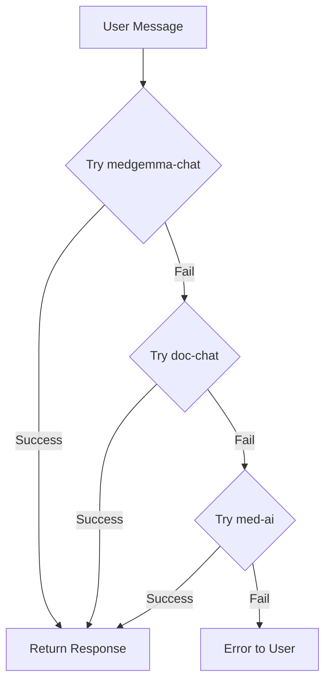

# AI Diagnostic Assistant Setup Guide

## Overview

The Doc 0 Clock AI Diagnostic Assistant uses a **three-tier fallback system** to ensure continuous AI service availability:

1. **Primary**: `medgemma-chat` - Hugging Face MedGemma (specialized medical AI)
2. **Secondary**: `doc-chat` - Lovable AI with Gemini 2.5 Flash (vision-capable)
3. **Final Fallback**: `med-ai` - OpenAI GPT-3.5-turbo

## Architecture



## Edge Functions

### 1. medgemma-chat (Primary)

**Purpose**: Specialized medical AI using Google's MedGemma model
**Model**: `google/medgemma-7b` via Hugging Face
**Capabilities**:
- Medical symptom analysis
- Evidence-based health information
- Medication guidance
- Emergency detection

**Required Environment Variable**:
```
HF_TOKEN=your_hugging_face_token
```

**How to get HF_TOKEN**:
1. Go to [Hugging Face](https://huggingface.co/)
2. Sign up or log in
3. Go to Settings → Access Tokens
4. Create a new token with "Read" permissions
5. Copy the token

### 2. doc-chat (Secondary)

**Purpose**: Vision-capable AI for medical image analysis
**Model**: `google/gemini-2.5-flash` via Lovable AI Gateway
**Capabilities**:
- All medgemma-chat capabilities
- Medical image analysis (X-rays, lab results, scans)
- Multi-modal conversations
- Diagnosis history tracking

**Required Environment Variable**:
```
LOVABLE_API_KEY=your_lovable_api_key
```

**How to get LOVABLE_API_KEY**:
1. Contact Lovable support or check your Lovable project dashboard
2. Navigate to API settings
3. Generate or copy your API key

### 3. med-ai (Final Fallback)

**Purpose**: Reliable fallback using OpenAI
**Model**: `gpt-3.5-turbo`
**Capabilities**:
- General medical information
- Symptom analysis
- Health guidance
- Emergency detection

**Required Environment Variable**:
```
OPENAI_API_KEY=your_openai_api_key
```

**How to get OPENAI_API_KEY**:
1. Go to [OpenAI Platform](https://platform.openai.com/)
2. Sign up or log in
3. Go to API Keys section
4. Create a new API key
5. Copy the key (you won't be able to see it again)

## Deployment Steps

### Step 1: Configure Environment Variables in Supabase

1. Go to your Supabase project dashboard
2. Navigate to **Settings** → **Edge Functions**
3. Add the following environment variables:

```env
# Primary AI (Hugging Face MedGemma)
HF_TOKEN=hf_xxxxxxxxxxxxxxxxxxxxxxxxxxxxx

# Secondary AI (Lovable AI Gateway)
LOVABLE_API_KEY=lovable_xxxxxxxxxxxxxxxxxxxxx

# Final Fallback (OpenAI)
OPENAI_API_KEY=sk-xxxxxxxxxxxxxxxxxxxxxxxxxxxxx
```

> **Note**: You can configure just one or all three. The system will automatically fall back to the next available service.

### Step 2: Deploy Edge Functions

Deploy all three Edge Functions to Supabase:

```bash
# Deploy medgemma-chat
supabase functions deploy medgemma-chat

# Deploy doc-chat
supabase functions deploy doc-chat

# Deploy med-ai
supabase functions deploy med-ai
```

### Step 3: Verify Deployment

Test each function individually:

```bash
# Test medgemma-chat
supabase functions invoke medgemma-chat --body '{"message":"Hello, I have a headache"}'

# Test doc-chat
supabase functions invoke doc-chat --body '{"message":"Hello, I have a headache"}'

# Test med-ai
supabase functions invoke med-ai --body '{"message":"Hello, I have a headache"}'
```

## Testing the Fallback System

### Scenario 1: All Services Available
- User sends message
- `medgemma-chat` responds successfully
- Response time: ~2-3 seconds

### Scenario 2: Primary Fails
- User sends message
- `medgemma-chat` fails (HF_TOKEN missing or quota exceeded)
- System automatically tries `doc-chat`
- `doc-chat` responds successfully
- Response time: ~3-4 seconds

### Scenario 3: Primary and Secondary Fail
- User sends message
- `medgemma-chat` fails
- `doc-chat` fails (LOVABLE_API_KEY missing)
- System automatically tries `med-ai`
- `med-ai` responds successfully
- Response time: ~4-5 seconds

### Scenario 4: All Services Fail
- User receives error message
- Error is logged to console
- User can retry

## Cost Considerations

### Hugging Face (medgemma-chat)
- **Free Tier**: 1,000 requests/month
- **Pro**: $9/month for 10,000 requests
- **Enterprise**: Custom pricing

### Lovable AI (doc-chat)
- Check your Lovable project pricing
- Typically included in Lovable subscription

### OpenAI (med-ai)
- **GPT-3.5-turbo**: $0.0015 per 1K input tokens, $0.002 per 1K output tokens
- Approximately $0.002 per conversation turn
- Very cost-effective for fallback usage

## Recommended Configuration

### For Development
Configure only `LOVABLE_API_KEY` or `OPENAI_API_KEY` for simplicity.

### For Production
Configure all three for maximum reliability:
1. **HF_TOKEN** - Best for medical accuracy
2. **LOVABLE_API_KEY** - Best for image analysis
3. **OPENAI_API_KEY** - Most reliable fallback

## Monitoring

### Check Function Logs

In Supabase:
1. Go to **Edge Functions**
2. Select a function
3. View **Logs** tab

Look for:
- `"Trying medgemma-chat..."` - Primary attempt
- `"medgemma-chat failed, trying doc-chat..."` - Fallback to secondary
- `"doc-chat failed, trying med-ai..."` - Fallback to final
- `"All AI functions failed"` - Complete failure

### Analytics

The `doc-chat` function automatically saves diagnosis history to the `ai_diagnosis_history` table for authenticated users.

Query diagnosis history:
```sql
SELECT * FROM ai_diagnosis_history
WHERE user_id = auth.uid()
ORDER BY created_at DESC;
```

## Troubleshooting

### Error: "HF_TOKEN not configured"
- Add `HF_TOKEN` to Supabase Edge Functions environment variables
- Or remove the try-catch for medgemma-chat if you don't want to use it

### Error: "LOVABLE_API_KEY not configured"
- Add `LOVABLE_API_KEY` to Supabase Edge Functions environment variables
- Or ensure the fallback to med-ai is working

### Error: "OPENAI_API_KEY not configured"
- Add `OPENAI_API_KEY` to Supabase Edge Functions environment variables
- This is the final fallback, so all services will fail without it

### Error: "Rate limit exceeded"
- Hugging Face free tier has limits
- Upgrade to Pro or configure other fallbacks
- OpenAI has generous rate limits

### Error: "Invalid response from AI"
- Check function logs for detailed error
- Verify API keys are correct
- Check API service status

## Security Best Practices

1. **Never commit API keys** to version control
2. **Use environment variables** for all sensitive data
3. **Rotate keys regularly** (every 90 days)
4. **Monitor usage** to detect unauthorized access
5. **Set up billing alerts** to avoid unexpected charges

## Feature Enhancements

### Medical Image Analysis (doc-chat only)

The `doc-chat` function supports medical image analysis:

```typescript
// Frontend code
const response = await supabase.functions.invoke('doc-chat', {
  body: {
    message: 'Please analyze this X-ray',
    image: base64ImageData, // base64 encoded image
    conversationHistory: []
  }
});
```

### Conversation History

All functions support conversation history for context:

```typescript
const response = await supabase.functions.invoke('medgemma-chat', {
  body: {
    message: 'What about fever?',
    conversationHistory: [
      { role: 'user', content: 'I have a headache' },
      { role: 'assistant', content: 'I understand you have a headache...' }
    ]
  }
});
```

## Next Steps

1. ✅ Deploy all three Edge Functions
2. ✅ Configure environment variables
3. ✅ Test each function individually
4. ✅ Test the fallback chain
5. ✅ Monitor logs and usage
6. ✅ Set up billing alerts
7. ✅ Enable diagnosis history tracking

## Support

If you encounter issues:
1. Check Supabase Edge Function logs
2. Verify environment variables are set
3. Test API keys independently
4. Review this documentation
5. Check API service status pages

---

**Last Updated**: 2025-11-23
**Version**: 1.0
